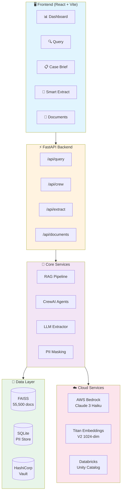
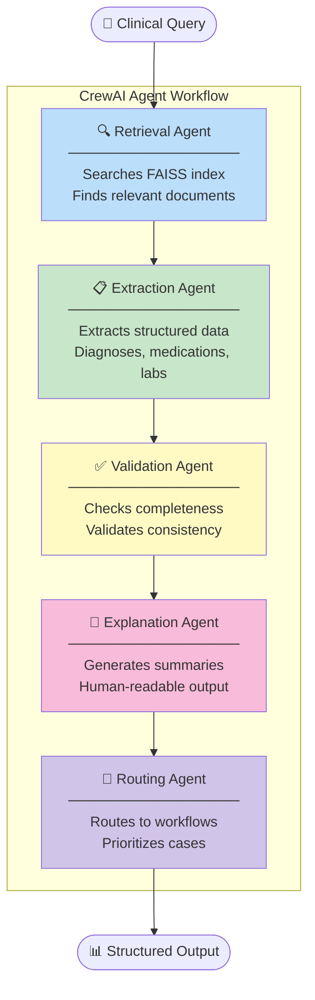
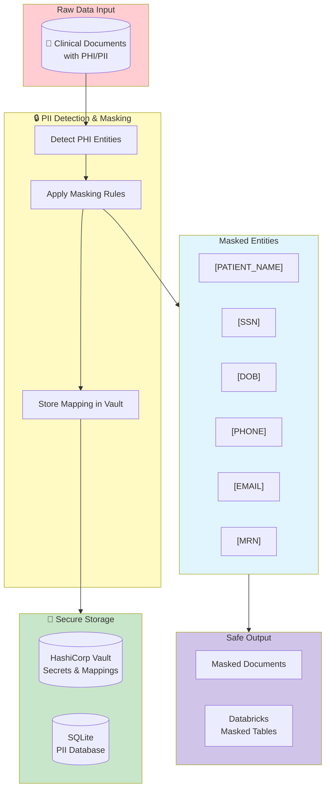
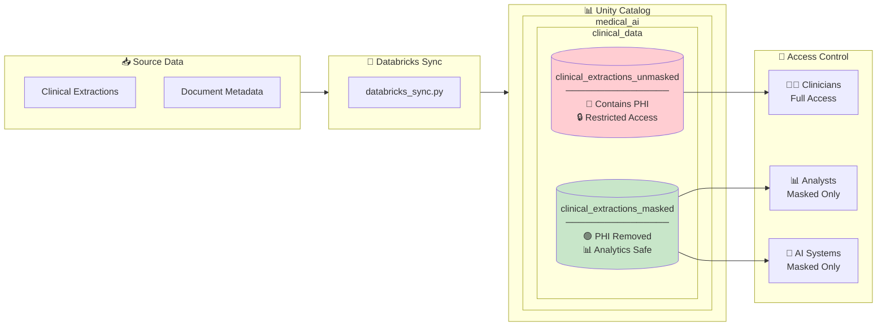
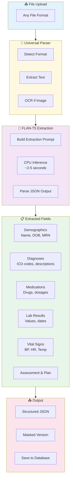
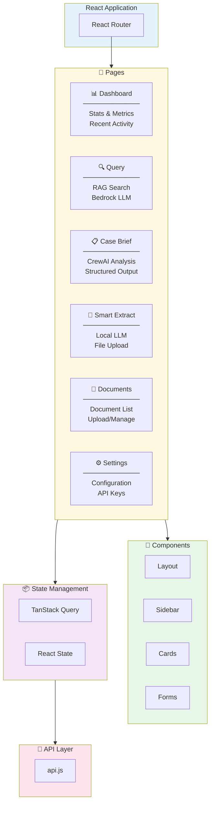
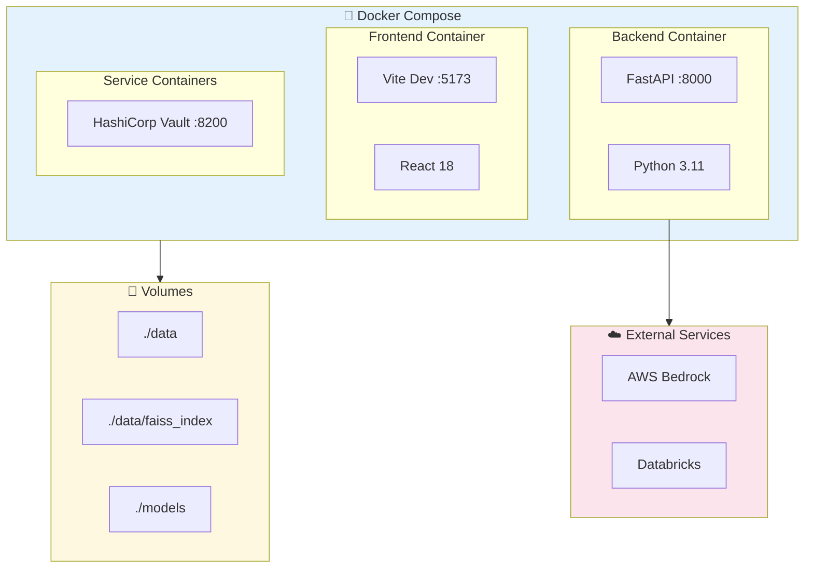

# 🏥 AI Clinical Documentation Assistant

> Healthcare-grade AI system for extracting structured clinical data from any document format using multi-agent workflows, local LLM extraction, and enterprise data governance.

[](https://www.python.org/downloads/)
[](https://fastapi.tiangolo.com/)
[](https://reactjs.org/)
[](https://www.crewai.com/)
[](https://opensource.org/licenses/MIT)

---

## ✨ Features

- **🤖 5-Agent CrewAI Workflow** — Intelligent case analysis with specialized agents for retrieval, extraction, validation, explanation, and routing
- **📄 Universal File Parser** — Supports PDF, Word, Excel, CSV, JSON, XML, HL7, FHIR, CDA, and Images (OCR)
- **🧠 Local LLM Extraction** — CPU-optimized FLAN-T5 for clinical data extraction without cloud dependency
- **☁️ AWS Bedrock Integration** — Claude 3 Haiku for reasoning + Titan Embeddings V2 for semantic search
- **🔍 FAISS Vector Store** — 55,500+ indexed clinical documents with fast similarity search
- **🔒 PHI/PII Masking** — Automatic detection and masking of protected health information
- **🏦 HashiCorp Vault** — Secure secrets management for credentials and API keys
- **📊 Databricks Sync** — Unity Catalog integration with masked/unmasked table separation
- **🎨 Modern React UI** — Dashboard, Query, Case Brief, Smart Extract, and Document Management

---

## 🏗️ System Architecture



---

## 🔄 Data Flow Architecture

```mermaid
flowchart LR
    subgraph Input["📥 Input Sources"]
        PDF[PDF]
        Word[Word]
        HL7[HL7/FHIR]
        CSV[CSV/Excel]
        Images[Images]
    end

    subgraph Parser["📄 Universal Parser"]
        FileParser[File Parser]
        OCR[Tesseract OCR]
    end

    subgraph Processing["⚙️ Processing"]
        Masking[PII Masking]
        Chunking[Text Chunking]
        Embedding[Titan Embeddings]
    end

    subgraph Storage["💾 Storage"]
        FAISS[(FAISS Index)]
        PII[(PII Database)]
        Vault[(Vault Secrets)]
    end

    subgraph AI["🤖 AI Layer"]
        LocalLLM[FLAN-T5 Base]
        Bedrock[Claude 3 Haiku]
        CrewAI[CrewAI Agents]
    end

    subgraph Output["📤 Output"]
        JSON[Structured JSON]
        Databricks[(Databricks)]
        UI[React UI]
    end

    Input --> Parser
    Parser --> Processing
    Processing --> Storage
    Storage --> AI
    AI --> Output

    style Input fill:#ffebee
    style Parser fill:#fff8e1
    style Processing fill:#e8f5e9
    style Storage fill:#e3f2fd
    style AI fill:#f3e5f5
    style Output fill:#e0f2f1
```



---

## 🤖 CrewAI Multi-Agent Workflow



---

## 🔐 Security Architecture



---

## 📊 Databricks Integration



---

## 🧠 Local LLM Extraction Pipeline



---

## 🖥️ Frontend Component Architecture



---

## 🔌 Infrastructure Deployment



---

## 🚀 Quick Start

### Prerequisites

- Python 3.11+
- Node.js 18+
- AWS credentials configured (for Bedrock)
- HashiCorp Vault (optional, for secrets)

### Installation

```bash
# Clone the repository
git clone git@github.com:kaziNymul/Medical_Assistant.git
cd Medical_Assistant

# Create virtual environment
python -m venv venv
source venv/bin/activate  # Linux/Mac
# or: venv\Scripts\activate  # Windows

# Install Python dependencies
pip install -r requirements.txt

# Install frontend dependencies
cd frontend && npm install && cd ..

# Setup environment
cp .env.example .env
# Edit .env with your credentials
```

### Configuration

Create a `.env` file with:

```env
# AWS Bedrock
AWS_REGION=us-east-1
AWS_ACCESS_KEY_ID=your_key
AWS_SECRET_ACCESS_KEY=your_secret
BEDROCK_MODEL_ID=anthropic.claude-3-haiku-20240307-v1:0
BEDROCK_EMBEDDING_MODEL=amazon.titan-embed-text-v2:0

# HashiCorp Vault
VAULT_ADDR=http://127.0.0.1:8200
VAULT_TOKEN=your_vault_token

# Databricks (optional)
DATABRICKS_HOST=your_workspace.cloud.databricks.com
DATABRICKS_TOKEN=your_token
DATABRICKS_CATALOG=medical_ai
DATABRICKS_SCHEMA=clinical_data

# Local LLM
EXTRACTION_MODEL=google/flan-t5-base
EXTRACTION_DEVICE=cpu
```

### Running the Application

```bash
# Terminal 1: Start the backend
source venv/bin/activate
uvicorn src.api.app:app --reload --host 0.0.0.0 --port 8000

# Terminal 2: Start the frontend
cd frontend
npm run dev
```

Access the application at `http://localhost:5173`

---

## 📁 Project Structure

```
medical_assistant/
├── src/
│   ├── api/
│   │   ├── app.py              # FastAPI application
│   │   └── routes.py           # API endpoints
│   ├── crew/
│   │   ├── agents.py           # CrewAI agent definitions
│   │   ├── tasks.py            # Agent task definitions
│   │   ├── tools.py            # Custom agent tools
│   │   └── crew.py             # Crew orchestration
│   ├── extraction/
│   │   ├── file_parser.py      # Universal file parser
│   │   └── llm_extractor.py    # Local FLAN-T5 extractor
│   ├── rag/
│   │   ├── pipeline.py         # RAG orchestration
│   │   ├── embeddings.py       # Bedrock embeddings
│   │   └── vector_store.py     # FAISS operations
│   ├── utils/
│   │   ├── masking.py          # PHI/PII masking
│   │   ├── vault.py            # HashiCorp Vault client
│   │   └── databricks_sync.py  # Databricks sync
│   └── databricks/
│       ├── client.py           # Databricks client
│       └── tables.py           # Table management
├── frontend/
│   ├── src/
│   │   ├── components/         # React components
│   │   ├── pages/              # Page components
│   │   └── utils/api.js        # API client
│   └── package.json
├── config/
│   ├── settings.py             # Application settings
│   └── extraction.env          # Extraction config
├── scripts/
│   ├── setup_local_llm.sh      # LLM setup script
│   ├── setup_vault.sh          # Vault setup
│   └── deploy.sh               # Deployment script
├── data/
│   ├── raw/                    # Raw input files
│   ├── processed/              # Processed documents
│   └── pii/                    # PII database
├── docker-compose.yml
├── Dockerfile
├── requirements.txt
└── README.md
```

---

## 🤖 CrewAI Agents

| Agent | Role | Description |
|-------|------|-------------|
| **Retrieval Agent** | Document Finder | Searches FAISS index for relevant clinical documents |
| **Extraction Agent** | Data Extractor | Extracts structured fields (diagnoses, medications, labs) |
| **Validation Agent** | Quality Checker | Validates completeness and consistency of extracted data |
| **Explanation Agent** | Communicator | Generates human-readable clinical summaries |
| **Routing Agent** | Coordinator | Routes cases to appropriate workflows |

---

## 📄 Supported File Formats

| Format | Extension | Parser |
|--------|-----------|--------|
| PDF | `.pdf` | PyMuPDF + OCR fallback |
| Word | `.docx`, `.doc` | python-docx |
| Excel | `.xlsx`, `.xls` | openpyxl |
| CSV | `.csv` | pandas |
| JSON | `.json` | Native Python |
| XML | `.xml` | ElementTree |
| HL7 v2 | `.hl7` | Custom parser |
| FHIR | `.json` | FHIR R4 parser |
| CDA | `.xml` | CDA R2 parser |
| Images | `.png`, `.jpg` | Tesseract OCR |

---

## 📊 API Endpoints

### Query Endpoints
```
POST /api/query                 # RAG query with Bedrock
POST /api/query/semantic        # Semantic search only
```

### CrewAI Endpoints
```
POST /api/crew/analyze          # Full crew analysis
POST /api/crew/case-brief       # Generate case brief
GET  /api/crew/status/{id}      # Check task status
```

### Extraction Endpoints
```
POST /api/extract/upload        # Upload and parse file
POST /api/extract/process       # Extract with local LLM
GET  /api/extract/models        # List available models
POST /api/extract/databricks    # Sync to Databricks
```

---

## 🐳 Docker Deployment

```bash
# Build and run with Docker Compose
docker-compose up --build

# Or build individually
docker build -t medical-assistant .
docker run -p 8000:8000 -p 5173:5173 medical-assistant
```

---

## 📈 Performance

| Metric | Value |
|--------|-------|
| FAISS Index Size | 238.7 MB |
| Documents Indexed | 55,500 |
| Embedding Dimensions | 1,024 |
| Average Query Time | ~200ms |
| LLM Extraction Time | ~2-5s (CPU) |

---

## 🛣️ Roadmap

- [x] Phase 1: Local RAG Pipeline
- [x] Phase 2: AWS Bedrock Integration
- [x] Phase 3: Databricks Lakehouse
- [x] CrewAI Multi-Agent Workflow
- [x] Local LLM Extraction (FLAN-T5)
- [x] React Frontend
- [ ] MCP Server Implementation
- [ ] Kubernetes Deployment
- [ ] HIPAA Compliance Audit

---

## ⚠️ Disclaimer

This system is designed for **clinical documentation assistance only**. It does NOT:
- Make clinical decisions
- Prescribe medications
- Provide diagnoses

All AI outputs must be reviewed by qualified healthcare professionals.

---

## 👨‍💻 Author

**Kazi Nymul** — [GitHub](https://github.com/kaziNymul)

---

## 📄 License

This project is licensed under the MIT License - see the [LICENSE](LICENSE) file for details.

---

<p align="center">
  Made with ❤️ for Healthcare AI
</p>
